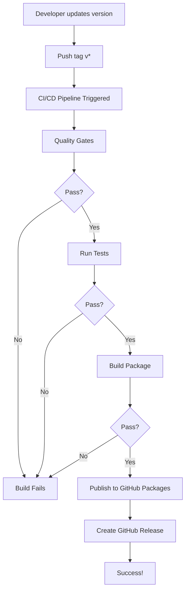

# 🎯 CI/CD Implementation Summary

Complete overview of the CI/CD setup for Nuxt4-Design-System.

## 📦 What Was Implemented

### 1. **GitHub Actions Workflows**

Created two automated workflows:

#### **Main CI/CD Pipeline** (`.github/workflows/ci-cd.yml`)

- **Triggers**: Push to main/develop, pull requests, version tags
- **Jobs**:
    - Quality gates (linting, type checking, formatting)
    - Test suite across Node.js 18, 20, 22
    - Build verification
    - Automated publishing to GitHub Packages (tags only)
    - GitHub Release creation

#### **PR Checks** (`.github/workflows/pr-checks.yml`)

- **Triggers**: Pull requests
- **Features**:
    - Quality validation
    - Bundle size analysis
    - Automated PR comments with size impact

### 2. **Package Configuration**

Updated `package.json`:

```json
{
    "publishConfig": {
        "registry": "https://npm.pkg.github.com",
        "access": "public"
    }
}
```

### 3. **Documentation**

Created comprehensive guides:

- **[CI/CD Guide](CI-CD-GUIDE.md)**: Complete workflow documentation
- **[Workflows Reference](WORKFLOWS-REFERENCE.md)**: Quick reference card
- **[Publishing Guide](../README-PUBLISHING.md)**: Updated with CI/CD info
- **[Main README](../README.md)**: Added CI/CD section

### 4. **Configuration Files**

- `.npmrc.example`: Template for GitHub Packages authentication
- Workflow files with optimized job dependencies

---

## 🚀 How It Works

### Automated Publishing Flow



### Quality Gates Flow

```
Push/PR → Lint → Type Check → Format Check → Security Audit
            ↓         ↓            ↓              ↓
           Pass      Pass         Pass          Pass
            ↓         ↓            ↓              ↓
         Tests → Build → Bundle Size → Success!
```

---

## 🎯 Key Features

### 1. **Automated Quality Assurance**

Every code change goes through:

- ✅ ESLint validation
- ✅ TypeScript type checking
- ✅ Prettier format verification
- ✅ npm security audit
- ✅ Unit tests on multiple Node versions
- ✅ Build verification
- ✅ Bundle size monitoring

### 2. **Automated Publishing**

Version tags trigger:

- ✅ Full quality validation
- ✅ Package build
- ✅ Publishing to GitHub Packages
- ✅ GitHub Release creation with notes

### 3. **PR Feedback**

Pull requests get:

- ✅ Automated quality checks
- ✅ Bundle size impact analysis
- ✅ Inline comments with results
- ✅ Pass/fail status

### 4. **Multi-Node Testing**

Tests run on:

- Node.js 18.x
- Node.js 20.x
- Node.js 22.x (with coverage)

---

## 📋 Usage Guide

### For Developers

#### Making Changes

```bash
# 1. Create feature branch
git checkout -b feature/my-feature

# 2. Make changes and commit
git add .
git commit -m "feat: add new feature"

# 3. Push and create PR
git push origin feature/my-feature
# Create PR on GitHub

# 4. Wait for checks
# CI runs automatically
# Review bundle size comment
# Fix any issues
```

#### Publishing New Version

```bash
# 1. Ensure you're on main
git checkout main
git pull

# 2. Update version
npm version patch  # or minor/major
# This creates a commit and tag

# 3. Push with tags
git push origin main --tags

# 4. Monitor deployment
# Go to GitHub Actions tab
# Watch CI/CD Pipeline workflow
# Verify success
```

### For Maintainers

#### Reviewing PRs

1. **Check CI status**: Ensure all checks pass
2. **Review bundle size**: Check automated comment
3. **Review code**: Normal code review process
4. **Merge**: Use squash merge for clean history

#### Managing Releases

1. **Monitor workflow**: Check Actions tab
2. **Verify publication**: Check Packages tab
3. **Test installation**: Try installing new version
4. **Update docs**: Ensure documentation is current

---

## 🔐 Security & Permissions

### Required Permissions

The workflows use `GITHUB_TOKEN` with:

- `contents: write` - For creating releases
- `packages: write` - For publishing packages

### Security Features

- ✅ Automated security audits
- ✅ No secrets in code
- ✅ Scoped token permissions
- ✅ Dependency vulnerability scanning

---

## 📊 Monitoring & Metrics

### What Gets Tracked

1. **Build Status**: Pass/fail for each workflow
2. **Bundle Size**: Tracked on every build
3. **Test Coverage**: Generated on Node 22
4. **Security Issues**: From npm audit
5. **Deployment Success**: Publishing status

### Where to Find Metrics

- **Actions Tab**: All workflow runs
- **Packages Tab**: Published packages
- **Releases Tab**: Release history
- **PR Comments**: Bundle size impact

---

## 🛠️ Maintenance

### Regular Tasks

#### Weekly

- [ ] Review security audit results
- [ ] Check for dependency updates
- [ ] Monitor bundle size trends

#### Monthly

- [ ] Review workflow efficiency
- [ ] Update Node.js versions if needed
- [ ] Check for GitHub Actions updates

#### Per Release

- [ ] Verify all tests pass
- [ ] Check bundle size
- [ ] Update changelog
- [ ] Test package installation

---

## 🐛 Troubleshooting

### Common Issues & Solutions

#### 1. Publishing Fails

**Problem**: Publish job fails with authentication error

**Solution**:

```bash
# Check package.json name
# Must be: @boilerplatepowa/nuxt4-design-system

# Verify publishConfig
{
  "publishConfig": {
    "registry": "https://npm.pkg.github.com",
    "access": "public"
  }
}

# Ensure tag format is v*
git tag v1.0.0  # ✅ Correct
git tag 1.0.0   # ❌ Wrong
```

#### 2. Tests Fail in CI

**Problem**: Tests pass locally but fail in CI

**Solution**:

```bash
# Match CI Node version
nvm use 22.18.0

# Clear cache
rm -rf node_modules package-lock.json
npm install

# Run tests
npm run test:ci
```

#### 3. Bundle Size Exceeded

**Problem**: Bundle size exceeds 250KB limit

**Solution**:

```bash
# Analyze bundle
npm run build:analyze

# Common fixes:
# - Use dynamic imports
# - Remove unused dependencies
# - Optimize images/assets
# - Enable tree shaking
```

---

## 📈 Success Metrics

### Current Status

- ✅ Automated quality gates: **Active**
- ✅ Multi-version testing: **Active**
- ✅ Automated publishing: **Active**
- ✅ PR feedback: **Active**
- ✅ Bundle monitoring: **Active**

### Performance

- Average workflow time: **5-10 minutes**
- Test coverage target: **85%+**
- Bundle size limit: **250KB**
- Security audit: **No critical issues**

---

## 🎓 Best Practices

### Do's ✅

1. **Always test locally** before pushing
2. **Use conventional commits** for better changelog
3. **Update version** using npm version command
4. **Monitor workflow runs** after pushing tags
5. **Review PR feedback** before merging
6. **Keep dependencies updated**

### Don'ts ❌

1. **Don't skip tests** to speed up publishing
2. **Don't ignore bundle size warnings**
3. **Don't push broken code** to main
4. **Don't ignore security audits**
5. **Don't manually edit version** in package.json
6. **Don't force push** to main branch

---

## 📚 Related Documentation

- **[CI/CD Guide](CI-CD-GUIDE.md)**: Detailed workflow documentation
- **[Workflows Reference](WORKFLOWS-REFERENCE.md)**: Quick reference
- **[Publishing Guide](../README-PUBLISHING.md)**: Publishing instructions
- **[Main README](../README.md)**: Project overview

---

## 🔄 Version History

| Version | Date       | Changes                      |
| ------- | ---------- | ---------------------------- |
| 1.0.0   | 2025-01-XX | Initial CI/CD implementation |

---

## 📞 Support

For CI/CD issues:

1. **Check workflow logs**: Actions tab → Failed run → Job details
2. **Review documentation**: This file and related guides
3. **Search issues**: Check if others had similar problems
4. **Open issue**: Include workflow run ID and logs

---

## 🎉 Success!

Your CI/CD pipeline is now:

- ✅ Fully automated
- ✅ Quality-assured
- ✅ Well-documented
- ✅ Production-ready

**Next Steps:**

1. Push a test tag to verify workflow
2. Monitor the first automated deployment
3. Share documentation with team
4. Start using the automated workflow

---

_This CI/CD system ensures reliable, consistent deployments to GitHub Packages._
