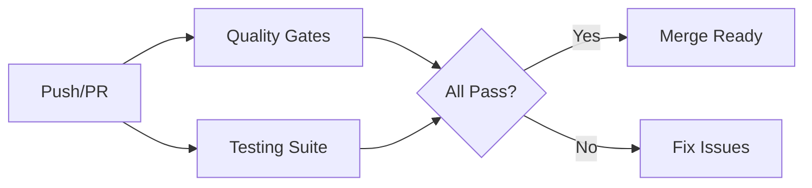
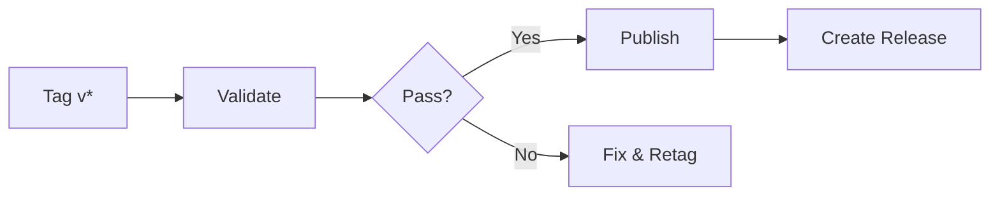

# 🔄 CI/CD Workflows Reference

Quick reference for GitHub Actions workflows in this project.

## 📊 Workflow Overview

| Workflow          | File                   | Triggers           | Duration |
| ----------------- | ---------------------- | ------------------ | -------- |
| Quality Gates     | `quality-gates.yml`    | Push, PR           | ~3-4 min |
| Testing Suite     | `testing.yml`          | Push, PR           | ~4-6 min |
| Release & Publish | `release.yml`          | Tags (v\*), Manual | ~5-8 min |
| Storybook Deploy  | `storybook-deploy.yml` | Push to main       | ~3-5 min |

---

## 🔷 Quality Gates (`quality-gates.yml`)

### Triggers

- Push to `main` or `develop`
- Pull requests to `main` or `develop`

### Jobs

#### **1. Lint & Format**

```yaml
Duration: ~2 minutes
Node: 22
```

**Checks:**

- ✅ ESLint validation
- ✅ TypeScript type checking (module only)
- ✅ Prettier format checking

**Exit Criteria:**

- All linting rules pass
- No TypeScript errors
- Code properly formatted

---

#### **2. Security Scan**

```yaml
Duration: ~1 minute
Node: 22
```

**Checks:**

- ✅ npm security audit (moderate level)
- ✅ Snyk vulnerability scanning (optional)

**Exit Criteria:**

- No moderate/high vulnerabilities
- Snyk scan passes (continues on error)

---

#### **3. Bundle Analysis**

```yaml
Duration: ~1 minute
Node: 22
```

**Checks:**

- ✅ Module build
- ✅ Bundle size validation (<250KB)
- ✅ Artifact upload

**Exit Criteria:**

- Build completes
- Bundle size within limits
- Artifacts uploaded

---

## 🔷 Testing Suite (`testing.yml`)

### Triggers

- Push to `main` or `develop`
- Pull requests to `main` or `develop`

### Jobs

#### **1. Unit Tests**

```yaml
Duration: ~2 minutes
Node: 22
Matrix: [22]
```

**Tests:**

- ✅ Vitest unit tests
- ✅ Component tests
- ✅ Coverage report (Codecov)

**Exit Criteria:**

- All tests pass
- Coverage uploaded

---

#### **2. Integration Tests**

```yaml
Duration: ~2 minutes
Node: 22
Depends on: unit-tests
```

**Tests:**

- ✅ Playground preparation
- ✅ Playground build
- ✅ Module integration

**Exit Criteria:**

- Playground builds successfully
- Integration validated

---

#### **3. Component Tests**

```yaml
Duration: ~2 minutes
Node: 22
Runs in parallel
```

**Tests:**

- ✅ Storybook build
- ✅ Component stories validation
- ✅ Artifact upload

**Exit Criteria:**

- Storybook builds successfully
- Stories validated

---

#### **4. Performance Tests**

```yaml
Duration: ~2 minutes
Node: 22
Depends on: integration-tests
```

**Tests:**

- ✅ Production build
- ✅ Lighthouse CI checks
- ✅ Performance validation

**Exit Criteria:**

- Performance benchmarks met
- Lighthouse scores acceptable

---

## 🔷 Release & Publish (`release.yml`)

### Triggers

- Push tags matching `v*` (e.g., `v1.0.0`)
- Manual workflow dispatch

### Jobs

#### **1. Validate Release**

```yaml
Duration: ~3 minutes
Node: 22
```

**Validation:**

- ✅ Run all tests
- ✅ Build module
- ✅ Validate package structure

**Exit Criteria:**

- Tests pass
- Build succeeds
- Package valid

---

#### **2. Publish to GitHub Packages** 🚀

```yaml
Duration: ~2 minutes
Node: 22
Depends on: validate
Condition: Tag push only
```

**Steps:**

- ✅ Configure npm registry
- ✅ Build production package
- ✅ Publish to GitHub Packages

**Exit Criteria:**

- Package published successfully
- Available in GitHub Packages

**Required:**

- Tag format: `v*`
- `GITHUB_TOKEN` permissions
- Valid `publishConfig` in package.json

---

#### **3. Create GitHub Release**

```yaml
Duration: ~1 minute
Node: 22
Depends on: publish
Condition: Tag push only
```

**Steps:**

- ✅ Generate changelog
- ✅ Create release notes
- ✅ Publish release

**Exit Criteria:**

- Release created
- Notes generated
- Visible in Releases tab

---

## 🔷 Storybook Deploy (`storybook-deploy.yml`)

### Triggers

- Push to `main` branch

### Purpose

Deploys Storybook documentation to GitHub Pages

**Duration:** ~3-5 minutes

---

## 📋 Common Workflows

### Publishing a New Version

```bash
# 1. Update version
npm version patch  # or minor, major

# 2. Push with tags
git push origin main --tags

# 3. Monitor workflows
# Visit: https://github.com/BoilerplatePowa/Nuxt4-Design-System/actions
```

**What runs:**

1. Quality Gates (on main push)
2. Testing Suite (on main push)
3. Release workflow (on tag detection)

---

### Running Quality Checks Locally

```bash
# Full quality suite
npm run lint              # ESLint
npm run test:types:module # TypeScript
npm run format:check      # Prettier
npm run security:audit    # Security

# Full test suite
npm run test              # Unit tests
npm run dev:prepare       # Prepare playground
npm run build-storybook   # Component tests

# Build verification
npm run build             # Module build
npm run bundle:size       # Size check
```

---

### Pull Request Workflow

When you create a PR:

1. **Quality Gates** run automatically
    - Linting, type checking, formatting
    - Security audit
    - Bundle analysis

2. **Testing Suite** runs automatically
    - Unit, integration, component tests
    - Performance validation

3. **Review results** in PR checks
    - All must pass before merge

---

## 🔧 Workflow Configuration

### Environment Variables

```yaml
# All workflows use:
NODE_VERSION: '22' # Node.js version
NPM_VERSION: '10' # npm version

# Release workflow also uses:
REGISTRY_URL: 'https://npm.pkg.github.com'
PACKAGE_SCOPE: '@boilerplatepowa'
```

### Permissions

```yaml
# Release workflow requires:
contents: write # For creating releases
packages: write # For publishing (set in repo settings)
```

---

## 🐛 Debugging Workflows

### View Workflow Logs

1. Go to **Actions** tab
2. Click on failed workflow run
3. Click on failed job
4. Expand failed step
5. Review error logs

### Common Issues

#### Quality Gates Fail

**Linting errors:**

```bash
npm run lint:fix
```

**Type errors:**

```bash
npm run test:types:module
```

**Format issues:**

```bash
npm run format
```

#### Tests Fail

**Run locally:**

```bash
npm run test
```

**Specific test:**

```bash
npm run test -- path/to/test.ts
```

#### Publishing Fails

**Check package.json:**

```json
{
    "name": "@boilerplatepowa/nuxt4-design-system",
    "publishConfig": {
        "registry": "https://npm.pkg.github.com",
        "access": "public"
    }
}
```

**Check tag format:**

```bash
git tag v1.0.0  # ✅ Correct
git tag 1.0.0   # ❌ Wrong (missing 'v')
```

**Check permissions:**

- Settings → Actions → Workflow permissions
- Enable "Read and write permissions"

---

## 📊 Workflow Status Badges

Add to your README:

```markdown


```

---

## 🎯 Workflow Matrix

| Event           | Quality | Testing | Release | Storybook |
| --------------- | ------- | ------- | ------- | --------- |
| Push to main    | ✅      | ✅      | ❌      | ✅        |
| Push to develop | ✅      | ✅      | ❌      | ❌        |
| Pull request    | ✅      | ✅      | ❌      | ❌        |
| Tag push (v\*)  | ❌      | ❌      | ✅      | ❌        |
| Manual dispatch | ❌      | ❌      | ✅      | ❌        |

---

## 📞 Support

For workflow issues:

1. **Check logs**: Actions tab → Run ID → Job → Step
2. **Review docs**: [CI/CD Guide](CI-CD-GUIDE.md)
3. **Common solutions**: See "Debugging Workflows" above
4. **Open issue**: Include run ID and error logs

---

## 🔄 Workflow Execution Flow

### On Push/PR



### On Tag Push



---

_Last updated: Based on actual workflow files in .github/workflows/_
